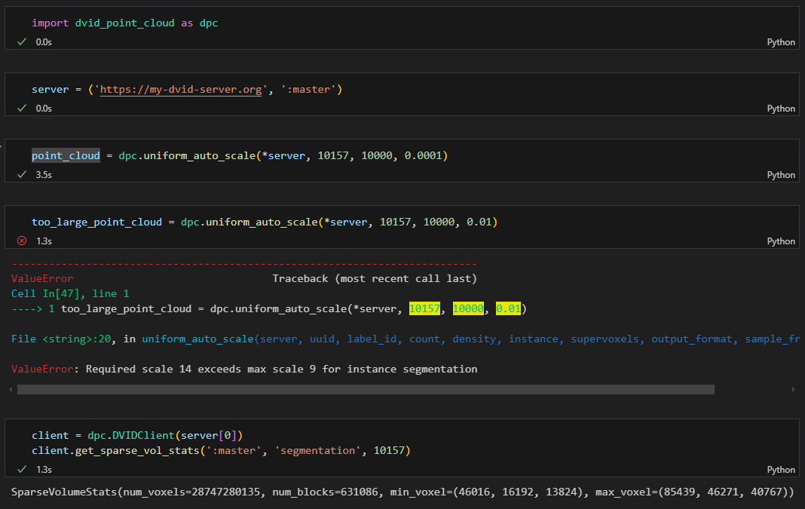
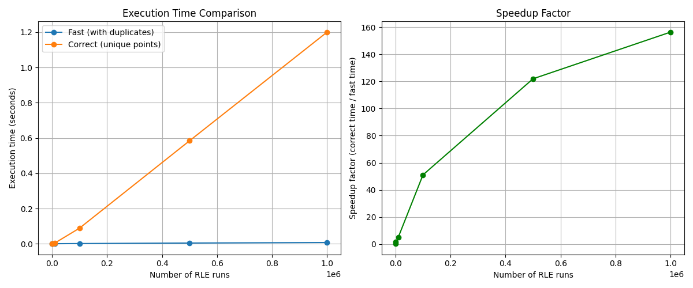

# dvid-point-cloud

Library for creating point clouds for sparse volumes within DVID, with support for multi-scale sampling and vectorized operations.

## Installation

```bash
pip install dvid-point-cloud
```

Or install from source:

```bash
git clone https://github.com/username/dvid-point-cloud.git
cd dvid-point-cloud
pip install -e .
```

For development, install with extra dependencies:

```bash
pip install -e ".[dev]"
```

## Usage

### Basic Point Cloud Generation

Generate a uniform point cloud from a DVID label:

```python
import dvid_point_cloud as dpc

# Define parameters
server = "http://my-dvid-server.janelia.org"
uuid = "bc9a0f"  # Hexadecimal string identifying the version
label_id = 189310  # The neuron/segment ID
density = 0.01  # Sample 1% of the voxels

# Generate the point cloud
point_cloud = dpc.uniform_sample(server, uuid, label_id, density)

# point_cloud is a numpy array with shape (N, 3) 
# where each row is an XYZ coordinate
print(f"Generated a point cloud with {len(point_cloud)} points")
```

### Multi-Scale Sampling

Sample points at different resolution scales, where the downsampling factor is 2**scale:

```python
# Sample at scale 0 (original resolution)
points_s0 = dpc.uniform_sample(server, uuid, label_id, density, scale=0)

# Sample at scale 2 (downsampled by factor of 4)
points_s2 = dpc.uniform_sample(server, uuid, label_id, density, scale=2)

# Sample at scale 3 (downsampled by factor of 8)
points_s3 = dpc.uniform_sample(server, uuid, label_id, density, scale=3)
```

### Fixed Count Sampling

Sample a specific number of points instead of a density:

```python
# Sample 1000 points
points = dpc.uniform_sample(server, uuid, label_id, 1000)
```

### Automatic scale selection

If you specify the number of sample points and the density of sampling,
the `uniform_auto_scale` function will determine the best scale (downsampling)
given the # of voxels associated with the given label.

```python
points = dpc.uniform_auto_scale(server, uuid, label_id, count=1000, density=0.01)
```

If the sparse volume for the label is too large to meet the sampling density with
the given number of points at any level, it will return a `ValueError` exception.
This is useful if you want to avoid using neurons that may be too large for your
given point budget. You can also use the `get_sparse_vol_stats` function to
quickly get statistics on even extremely large neurons (e.g., 28+ billion voxels)
as in the jupyter example below:




### DataFrame Output

Get results as a pandas DataFrame:

```python
# Get results as a DataFrame with x, y, z columns
df_points = dpc.uniform_sample(
    server, uuid, label_id, density, 
    output_format="dataframe"
)
print(df_points.head())
```

### Supervoxel Sampling

Sample from supervoxels instead of agglomerated bodies:

```python
# Sample from supervoxels
sv_points = dpc.uniform_sample(
    server, uuid, label_id, density,
    supervoxels=True
)
```

### Multiple Bodies

Generate point clouds for multiple bodies:

```python
body_ids = [189310, 189311, 189312]
# sample 10% of voxels
body_points = dpc.sample_for_bodies(
    server, uuid, "segmentation", body_ids, 0.1, scale=0
)

# body_points is a dictionary mapping body IDs to point clouds
for body_id, points in body_points.items():
    print(f"Body {body_id}: {len(points)} points")
```

### Guarantee Sampling With No Duplicates

The default sampling function does not guarantee results have no
duplicates (although it is unlikely). You can use a sampling function
with no duplicates guaranteed:

```python
# Sample 1000 points with no duplicates
points = dpc.uniform_sample(server, uuid, label_id, 1000, 
                        sample_from_rles_func=accurate_sample_rles)
```

There is a performance hit for very large sparse volumes as shown
in benchmarks folder.



### Neuroglancer Visualization

Generate Neuroglancer-compatible JSON for point cloud visualization:

```python
import json

# First generate the point cloud
points = dpc.uniform_sample(server, uuid, label_id, 1000, scale=0)

# Convert it to Neuroglancer JSON
layer_json = dpc.point_cloud_to_neuroglancer_json(
    points,
    name="my-point-cloud", 
    color="#00ff00",  # Green color
    point_size=2.0    # Slightly larger points
)

# Print or save the JSON
print(json.dumps(layer_json))

# You can then copy this JSON into a Neuroglancer annotation layer
# or use it programmatically with the Neuroglancer Python API
```

## Requirements

- Python 3.7+
- numpy
- pandas
- requests

## Performance

The library uses vectorized operations for efficient point cloud generation. Sampling performance improves at higher scale levels, making it practical to generate large point clouds quickly.

The scale parameter determines the downsampling factor (2**scale), so:
- Higher scales = faster processing time
- Lower scales = more detailed point clouds

## Development

### Running Tests

```bash
# Run all tests
pytest

# Run tests with coverage report
pytest --cov=dvid_point_cloud

# Run a specific test file
pytest tests/test_sampling.py

# Run a specific test
pytest tests/test_sampling.py::test_uniform_sample_integration
```

### Linting and Type Checking

```bash
# Run linter
flake8 dvid_point_cloud

# Run type checker
mypy dvid_point_cloud
```


